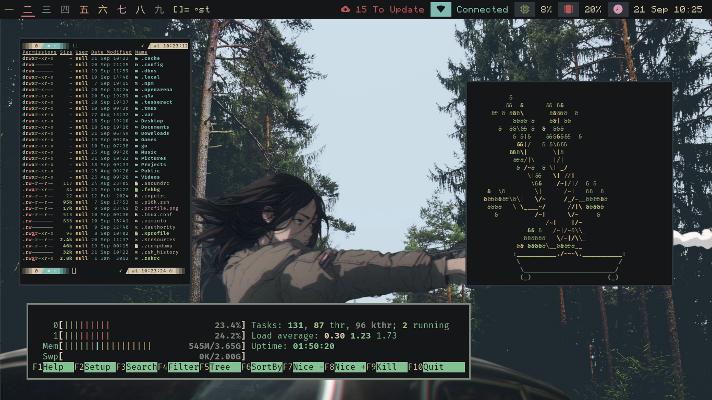
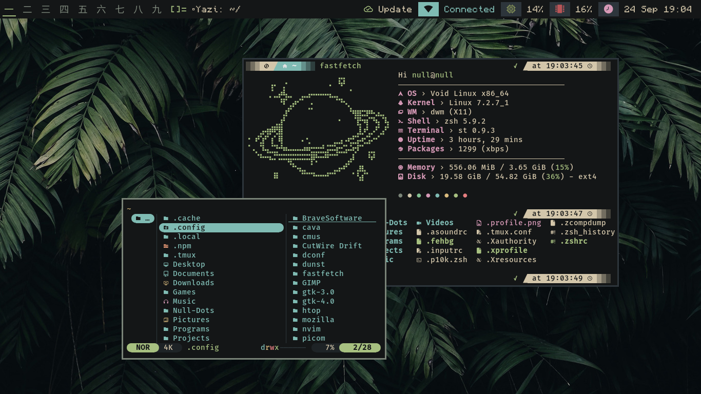
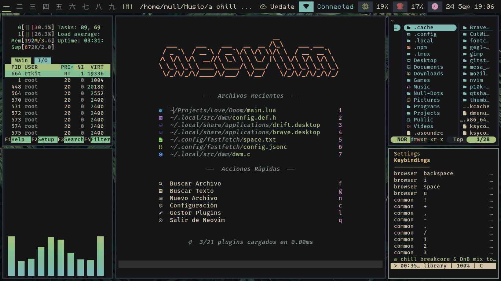
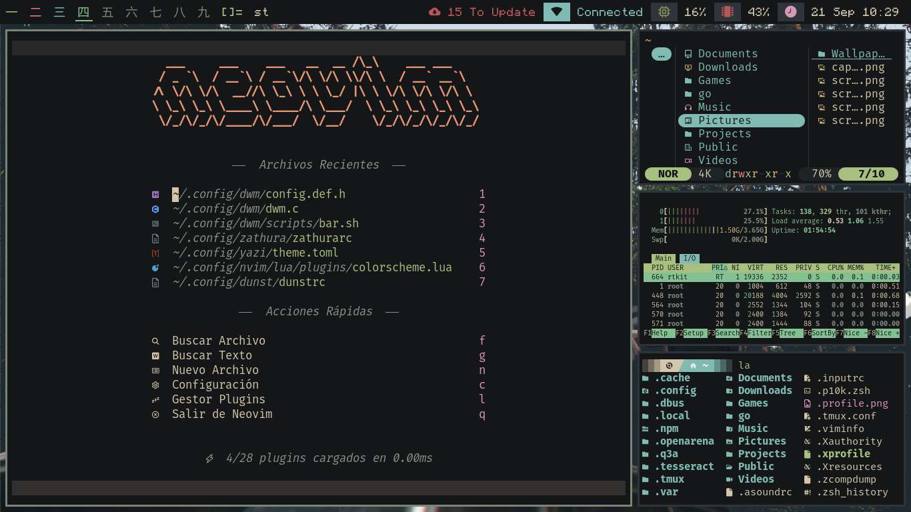

# Null Dotfiles
Mi configuración personal de Linux, enfocado en el uso del teclado y aplicaciones TUI.

## Sobre Mí
¡Hola! Mi nombre es Francisco. Me adentré en el mundo de la programación hace poco y me apasiona la filosofía Linux y el flujo de trabajo en la terminal. Es el motor que uso todos los días tanto para mis estudios como para mis proyectos. <3

## 📷 Previews
---





---

## 🛠️ System & Tools

| Component       | Selection         |
| :-------------- | :-----------------|
| **OS**          | Void Linux        |
| **Init System** | Runit             |
| **WM**          | Dwm / Picom       |
| **Terminal**    | St                |
| **Shell**       | Zsh               |
| **Editor**      | NeoVIM            |
| **File Manager**| Yazi              |
| **Colorscheme** | Everforest        |

---

## 🧰 Software & Aplicaciones Instalas
Lista de las aplicaciones principales que componen este sistema:

- **Editor de Código:** [Neovim](https://neovim.io/?utm_source=gemini)
- **Gestor de Archivos:** [Yazi](https://github.com/sxyazi/yazi?utm_source=gemini)
- **Lanzador de Apps:** Rofi
- **Compositor:** Picom
- **Notificaciones:** Dunst
- **Navegador Web:** Brave
- **Visualizador de Documentos:** Zathura
- **Reproductor de Música :** cmus
- **Capturas de Pantalla:** Maim + Slop

## 📂 Estructura de las Dotfiles

Organización general de las configuraciones incluidas en este repositorio:
```
.dotfiles/
├── assets/
├── configs/
│   ├── dunst
│   ├── fastfetch
│   ├── nvim
│   ├── picom
│   ├── redshift
│   ├── yazi
│   ├── zsh_plugins
│   └── zathura
├── Pictures/
│   └── Wallpapers/
├── local/
│   ├── share/
│   │   └── fonts/
│   └── src/
│       ├── dwm/
│       └── st/
├── .tmux/
├── .p10k.zsh
├── .tmux.conf
├── .xprofile
├── .Xresources
├── .zshrc
└── README.md
```

## ⌨️ Essential Keybindings

| Keybinding | Action |
| --- | --- |
| `Mod + Enter` | Open Terminal |
| `Mod + d` | Apps Launcher |
| `Mod + e` | File Explorer |
| `Mod + b` | Web Browser |
| `Mod + v` | Text Editor |
| `Mod + w` | Change Wallpaper |
| `Mod + z` | Open Books Reader |
| `Mod + p` | Toggle Scratchpad |
| `Mod + q` | Close Window |
| `Mod + j / k` | Focus Next / Previous Window |
| `Mod + Shift + j / k` | Move Window Up / Down |
| `Mod + h / l` | Decrease / Increase Master Area Size |
| `Mod + m` | Focus Master Window |
| `Mod + a` | Zoom / Swap Window to Master |
| `Mod + f` | Toggle Fullscreen |
| `Mod + \` | Toggle Floating Mode |
| `Mod + Space` | Cycle Layouts |
| `Mod + s` | Toggle Gaps |
| `Mod + [1-9]` | Switch Workspace / Tag |
| `Alt + Tab` | Toggle Last Focused Tag |
| `Print` | Take Screenshot |
| `Volume Keys` | Lower / Raise / Mute Volume |
| `Power Key` | Power Menu / Shutdown |
| `Mod + Alt + q` | Quit Window Manager |

## ⚠️ Disclaimer & Advertencias
> [!WARNING]
>
> **LEER ANTES DE USAR**
>
> 1.  **Sin Instalador Automático:** Este repositorio **NO** incluye un script de instalación automatizado (`install.sh`). Cada archivo y configuración debe ser copiado y compilado manualmente
>
> 2.  **Riesgo de Bugs:** Estas dotfiles están hechas a la medida para mi hardware y flujo de trabajo específico. Es probable que encuentres errores, dependencias faltantes o comportamientos inesperados si las usas directamente en tu equipo.
>
> 3.  **Revisión Previa:** Se recomienda revisar y editar los archivos de configuración antes de aplicarlos en tu sistema.
>

## 📄 Licencia
Este repositorio se distribuye bajo la licencia **MIT**. Consulta el archivo `LICENSE` para más información.
